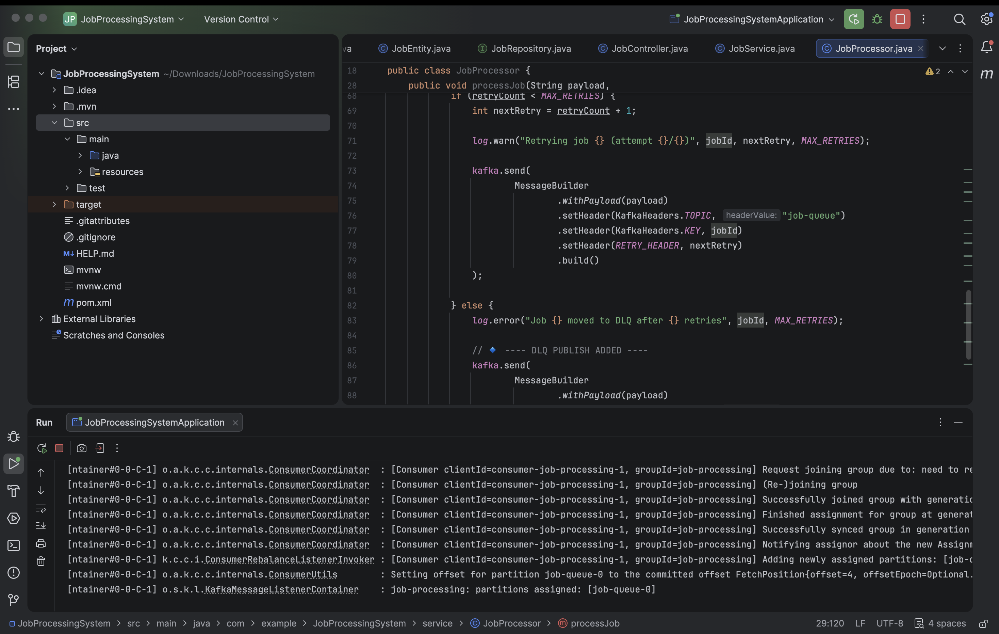
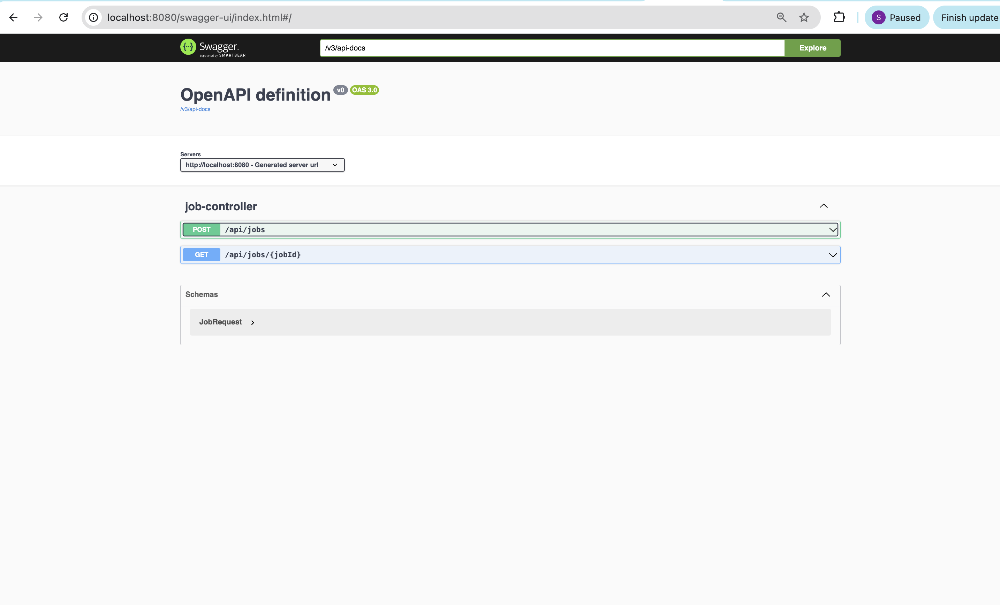
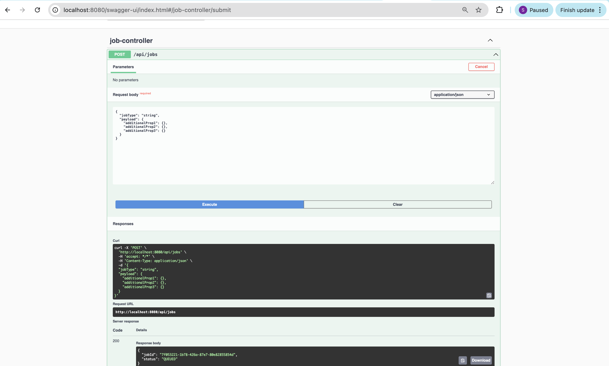

# 🚀 Job Processing System

A high-performance, distributed background job processing system for handling long-running tasks asynchronously.

---

## 🏗 Architecture (Conceptual)

```
API Service  →  Kafka Queue  →  Worker Service  →  PostgreSQL
                                   ↓
                                 Redis
                                   ↓
                         Dead Letter Queue (Kafka)
```

---

## 📡 API Endpoints

### 1️⃣ Submit Job

**Endpoint:** `POST /api/jobs`

**Request Example:**

```json
{
  "jobType": "REPORT_GENERATION",
  "payload": {
    "userId": 42,
    "dateRange": "last_30_days"
  }
}
```

**Response Example:**

```json
{
  "jobId": "a12f-93kd-88sa",
  "status": "QUEUED"
}
```

---

### 2️⃣ Get Job Status

**Endpoint:** `GET /api/jobs/{jobId}`

**In-Progress Response:**

```json
{
  "jobId": "a12f-93kd-88sa",
  "status": "IN_PROGRESS",
  "retries": 1,
  "result": null
}
```

**Completed Response:**

```json
{
  "jobId": "a12f-93kd-88sa",
  "status": "COMPLETED",
  "retries": 1,
  "result": {
    "fileUrl": "/reports/report_42.pdf"
  }
}
```

**Failed Response:**

```json
{
  "jobId": "a12f-93kd-88sa",
  "status": "FAILED",
  "retries": 3,
  "errorMessage": "PDF export service timeout"
}
```

---

## 🔄 Job Status Lifecycle

```
QUEUED → IN_PROGRESS → COMPLETED
          ↓
        FAILED → RETRYING → DEAD_LETTER
```

> Jobs retry up to **3 times** before moving to the **Dead Letter Queue (DLQ)**.

---

## 💾 Database Schema (Jobs Table)

| Column          | Type      | Description |
|-----------------|----------|-------------|
| job_id          | UUID     | Primary key |
| job_type        | String   | Type of task |
| payload_json    | Text     | Input payload |
| status          | Enum     | Job state |
| retries         | Int      | Retry count |
| result_json     | Text     | Output data |
| error_message   | String   | Failure reason |
| created_at      | Timestamp| Created time |
| updated_at      | Timestamp| Updated time |

---

## 🛠 Tech Stack

- Spring Boot (Java 21)  
- Apache Kafka  
- PostgreSQL  
- Redis  
- Maven  
- Swagger / OpenAPI  

---

## ⚙️ Setup & Run

```bash
# Clone repository
git clone https://github.com/username/JobProcessingSystem.git
cd JobProcessingSystem

# Make sure Kafka And Redis are already running in the background

# Build project
./mvnw clean install

# Run service
./mvnw spring-boot:run

```

---

## 📖 API Documentation

```
http://localhost:8080/swagger-ui.html
```

---


## 📸 Screenshots

### 🟢 Application Running


### 🟡 Swagger UI — API Endpoints


### 🔵 Swagger UI — API Output Example


